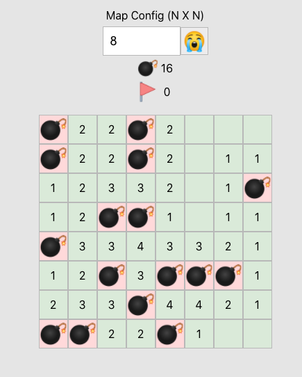

# mine-sweeper

Mine Swepper game for skill study and for fun 😆

[Let's play in here](seunghyum.github.io/mine-sweeper/)

## Spac

- Language : Typescript
- Frontend : React
- Store : Mobx
- Bundler : Wepback

## Data Structure

- Node : Node for each Board Cell
- NodeIndexMap : 2 Dimensional Array. Index of each Node. For access directly to Node when user click cell.
